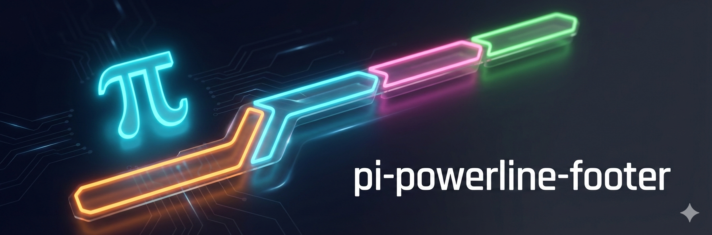

<p>
  
</p>

# pi-powerline-footer

Customizes the default [pi](https://github.com/badlogic/pi-mono) editor with a powerline-style status bar, welcome overlay, and editor stash. Inspired by [Powerlevel10k](https://github.com/romkatv/powerlevel10k) and [oh-my-pi](https://github.com/can1357/oh-my-pi).


## Features

**Editor stash** — Press `Alt+S` to save your editor content and clear the editor, type a quick prompt, and your stashed text auto-restores when the agent finishes. Toggles between stash, pop, and update-existing-stash. A `stash` indicator appears in the powerline bar while text is stashed.

**Working Vibes** — Optional standalone extension in `../pi-working-vibes` for AI-generated themed loading messages.

**Welcome overlay** — Branded splash screen shown as centered overlay on startup. Shows gradient logo, model info, keyboard tips, loaded AGENTS.md/extensions/skills/templates counts, and recent sessions. Auto-dismisses after 30 seconds or on any key press.

**Rounded box design** — Status renders directly in the editor's top border, not as a separate footer.

**Live thinking level indicator** — Shows current thinking level (`think:off`, `think:med`, etc.) with per-level colors. High and xhigh levels use a rainbow effect inspired by Claude Code's ultrathink.

**Smart defaults** — Nerd Font auto-detection for iTerm, WezTerm, Kitty, Ghostty, and Alacritty with ASCII fallbacks. Colors matched to oh-my-pi's dark theme.

**Git integration** — Async status fetching with 1s cache TTL. Automatically invalidates on file writes/edits. Shows branch, staged (+), unstaged (*), and untracked (?) counts.

**Context awareness** — Color-coded warnings at 70% (yellow) and 90% (red) context usage. Auto-compact indicator when enabled. If `pi-custom-compaction` is installed and enabled, the powerline automatically hides native context segments so the footer does not show stale post-summary usage.

**Token intelligence** — Smart formatting (1.2k, 45M), subscription detection (shows "(sub)" vs dollar cost).

## Installation

```bash
pi install npm:pi-powerline-footer
```

Restart pi to activate.

## Usage

Activates automatically. Toggle with `/powerline`, switch presets with `/powerline <name>`.

| Preset | Description |
|--------|-------------|
| `default` | Model, thinking, path (basename), git, context, tokens, cost |
| `minimal` | Just path (basename), git, context |
| `compact` | Model, git, cost, context |
| `full` | Everything including hostname, time, abbreviated path |
| `nerd` | Maximum detail for Nerd Font users |
| `ascii` | Safe for any terminal |
| `lucy` | Two-row Lucy layout with compact token/context counts and no inline unit prices |
| `lucy-cost` | Numeric-only Lucy view with exact token/context counts, total cost, and inline unit prices |
| `lucy-mini` | Narrow mobile/SSH layout with model, branch, token total, cost, and context |

**Environment:** `POWERLINE_NERD_FONTS=1` to force Nerd Fonts, `=0` for ASCII.

Preset selection is saved to `~/.pi/agent/settings.json` under `powerline` and restored on startup.
Run `/powerline default` to switch back to the default preset.

### Custom items from extension statuses

You can promote any extension status key into its own dedicated powerline item. This gives you a general way to register your own status items without changing this extension.

1. Any extension can publish status text through `ctx.ui.setStatus("my-key", "...value...")`.
2. Configure `powerline.customItems` to place those keys on the left, right, or secondary row.

```json
{
  "powerline": {
    "preset": "default",
    "customItems": [
      {
        "id": "ci",
        "statusKey": "ci-status",
        "position": "right",
        "prefix": "CI",
        "color": "warning"
      },
      {
        "id": "review",
        "position": "secondary",
        "hideWhenMissing": false,
        "prefix": "review"
      }
    ]
  }
}
```

`customItems` fields:

- `id` (required): unique item id (`a-z`, `A-Z`, `0-9`, `_`, `-`)
- `statusKey` (optional): extension status key to read, defaults to `id`
- `position` (optional): `left`, `right`, or `secondary` (default `right`)
- `prefix` (optional): text shown before the live status value
- `color` (optional): any Pi theme color (`warning`, `accent`, etc.) or hex (`#RRGGBB`)
- `hideWhenMissing` (optional): hide item when no status is present (default `true`)
- `excludeFromExtensionStatuses` (optional): omit this key from the aggregate `extension_statuses` segment (default `true`)

If you still prefer the old style, `"powerline": "default"` continues to work.

## Optional Vim navigation

Vim navigation has been split into the standalone local package `../pi-vim-editor`:

```bash
pi install /home/jhosscy/desk/projects/dev-tools/pi-vim-editor
```

Enable it with the existing setting:

```json
{
  "powerlineVimMode": true
}
```

Install `pi-vim-editor` before editor-wrapping extensions such as `pi-bash-mode` when using both.

## Editor Stash

Use `Alt+S` / `Option+S` as a quick stash toggle while drafting. It keeps one active stash and clears the editor when stashing.

| Editor | Stash | `Alt+S` result |
|--------|-------|----------------|
| Has text | Empty | Stash current text, clear editor |
| Empty | Has stash | Restore stash into editor |
| Has text | Has stash | Update stash with current text, clear editor |
| Empty | Empty | Show "Nothing to stash" |

Auto-restore after an agent run only happens when the editor is still empty. If you typed meanwhile, the stash is preserved.

The `stash` indicator appears in the powerline bar (on presets with `extension_statuses`). Active stash is still session-local and resets on session switch / disable, but stash history is persisted to `~/.pi/agent/powerline-footer/stash-history.json` so it survives restarts.

### Stash history

Open prompt history with either:

- `ctrl+alt+h`
- `/stash-history`

Prompt history now has two sources:

- stashed prompts — up to 12 recent stashed prompts (newest first)
- recent project prompts — up to 50 recent user-submitted prompts pulled from pi sessions in the current project folder

Selecting an entry inserts it into the editor. If the editor already has text, you can choose `Replace`, `Append`, or `Cancel`.

### Editor clipboard shortcuts

- `ctrl+alt+c` — copy full editor content
- `ctrl+alt+x` — cut full editor content (copy, then clear)

Copy/cut actions do not modify stash state or stash history.

### Shortcut configuration

You can override shortcut keys in `~/.pi/agent/settings.json`:

```json
{
  "powerlineShortcuts": {
    "stashHistory": "ctrl+alt+h",
    "copyEditor": "ctrl+alt+c",
    "cutEditor": "ctrl+alt+x"
  }
}
```

After changing bindings, run `/reload`. Invalid bindings, reserved key conflicts (like `Alt+S`), or duplicate conflicts automatically fall back to safe defaults.

## Working Vibes

Working Vibes has been split into the standalone local package `../pi-working-vibes`. Install it separately if you want themed loading messages:

```bash
pi install /home/jhosscy/desk/projects/dev-tools/pi-working-vibes
```

## Thinking Level Display

The thinking segment shows live updates when you change thinking level:

| Level | Display | Color |
|-------|---------|-------|
| off | `think:off` | gray |
| minimal | `think:min` | purple-gray |
| low | `think:low` | blue |
| medium | `think:med` | teal |
| high | `think:high` | rainbow |
| xhigh | `think:xhigh` | rainbow |

## Path Display

The path segment supports three modes:

| Mode | Example | Description |
|------|---------|-------------|
| `basename` | `powerline-footer` | Just the directory name (default) |
| `abbreviated` | `…/extensions/powerline-footer` | Full path with home abbreviated and length limit |
| `full` | `~/.pi/agent/extensions/powerline-footer` | Complete path with home abbreviated |

Configure via preset options: `path: { mode: "full" }`

## Segments

`model` · `thinking` · `path` · `git` · `subagents` · `token_in` · `token_out` · `token_total` · `cost` · `context_pct` · `context_total` · `time_spent` · `time` · `session` · `hostname` · `cache_read` · `cache_write` · `extension_statuses`

## Separators

`powerline` · `powerline-thin` · `slash` · `pipe` · `dot` · `chevron` · `star` · `block` · `none` · `ascii`

## Theming

Colors are configurable via pi's theme system. Each preset defines its own color scheme, and you can override individual colors and icons with a `theme.json` file in the extension directory.

### Default Colors

| Semantic | Theme Color | Description |
|----------|-------------|-------------|
| `model` | `#d787af` | Model name |
| `path` | `#00afaf` | Directory path |
| `gitClean` | `success` | Git branch (clean) |
| `gitDirty` | `warning` | Git branch (dirty) |
| `thinking` | `thinkingOff` | Thinking level (`off`) |
| `thinkingMinimal` | `thinkingMinimal` | Thinking level (`minimal`) |
| `thinkingLow` | `thinkingLow` | Thinking level (`low`) |
| `thinkingMedium` | `thinkingMedium` | Thinking level (`medium`) |
| `context` | `dim` | Context usage |
| `contextWarn` | `warning` | Context usage >70% |
| `contextError` | `error` | Context usage >90% |
| `cost` | `text` | Cost display |
| `tokens` | `muted` | Token counts |

### Custom Theme Override

Create `~/.pi/agent/extensions/powerline-footer/theme.json`:

```json
{
  "colors": {
    "pi": "#ff5500",
    "model": "accent",
    "path": "#00afaf",
    "gitClean": "success",
    "thinking": "thinkingOff",
    "thinkingMinimal": "thinkingMinimal",
    "thinkingLow": "thinkingLow",
    "thinkingMedium": "thinkingMedium"
  },
  "icons": {
    "auto": "↯",
    "warning": ""
  }
}
```

Colors can be:
- **Theme color names**: `accent`, `muted`, `dim`, `text`, `success`, `warning`, `error`, `border`, `borderAccent`, `borderMuted`
- **Hex colors**: `#ff5500`, `#d787af`

Icons can be any string, including `""` when you want to suppress a specific glyph entirely.

See `theme.example.json` for all available options.
